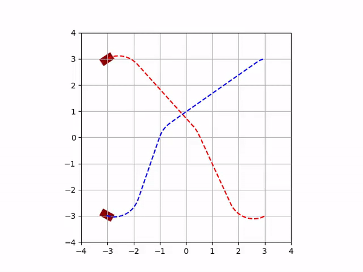

# TOMMA: Trajectory Optimization for Multiple Model-based Agents



Easy-to-use trajectory optimization for multiple agents using (potentially nonlinear) dynamics models.

## Install

TOMMA requires the optimization package, Ipopt. Installation instructions can be found [here](https://github.com/coin-or/Ipopt). Ipopt installation [using coinbrew](https://github.com/coin-or/Ipopt#using-coinbrew) is fairly straightforward.

This setup works well with a python virtual environment. Note: pip may need to be upgrade: `pip install --upgrade pip`

```
git clone git@github.com:mbpeterson70/tomma.git
pip install tomma/
```

## Code

`MultiAgentOptimization` in `multi_agent_optimization.py` can be used with a dynamics object to optimize trajectories (minimum-time) and perform model predictive control (fixed-time). A library of constraints can be easily added with the use of the `MultiAgentOptimization` class including adding input and state constraints, adding objects, and specifying the minimum distance between agents. 

See the [examples](examples/) directory for examples of using the `MultiAgentOptimization` class with Dubins and quadrotor dynamics.

## See Also

[ROS Rover Trajectory Optimization](https://github.com/mbpeterson70/rover_trajectory_opt_ros) is a ROS wrapper for using the TOMMA code on ground robots.
